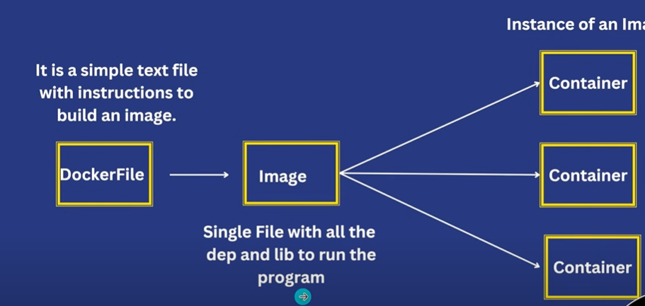

# Docker

### What is Docker?

Docker is an open-source containerization platform that allows you to pack your application and all its dependencies into a standardized unit called a container. Containers are lightweight, which makes them portable, and they are isolated from the underlying infrastructure and from each other container. You can run the Docker image as a Docker container on any machine where Docker is installed without depending on the operating system.

### Key Components of Docker

- **Docker Engine**: It is a core part of docker, that handles the creation and management of containers.
- **Docker Image:** It is a read-only template that is used for creating containers, containing the application code and dependencies.
- **Docker Hub:** It is a cloud based repository that is used for finding and sharing the container images.
- **Dockerfile:** It is a script that containing instructions to build a docker image.
- **Docker Registry** : It is a storage distribution system for docker images, where you can store the images in both public and private modes.

### Why we need Docker?

Docker is essential because it **simplifies application deployment, enables consistent environments across development, testing, and production, and facilitates resource efficiency by packaging applications into lightweight containers**

Realtime example:

let the developer developed an application using various tools like node, SQL, python
Now tester want to run this application for testing on his machine but it doesn't run bcoz of compatibility issue
so Solution is docker developer packaged an application now developed share this pkg to tester so it can run smoothly

### What is container?

- A way to package an application with all the necessary
dependencies and configuration.
- |t can be easily shared
- Makes deployment and development efficient.

### Flow of Docker



How to create Docker File?

```docker
# Use an official Python runtime as a parent image
FROM python:3.9-slim-buster

# Set the working directory in the container
WORKDIR /app

# Copy the current directory contents into the container at /app
COPY . /app

# Install any needed packages specified in requirements.txt
RUN pip install --no-cache-dir -r requirements.txt

# Make port 5000 available to the world outside this container
EXPOSE 5000

# Define environment variable
ENV NAME World

# Run app.py when the container launches
CMD ["python", "app.py"]
```

**Important Notes:**

- **`.dockerignore`:** Create a `.dockerignore` file in the same directory as your Dockerfile to exclude files and directories from being copied into the image. This helps to reduce the image size and improve build performance (e.g., `node_modules`, `venv`, `.git`).
- **`requirements.txt` (Python):** For Python applications, create a `requirements.txt` file listing all the project's dependencies. You can generate this file using `pip freeze > requirements.txt`.
- **`package.json` (Node.js):** For Node.js applications, dependencies are defined in the `package.json` file.

### Packaging Docker image of an application

1. Create Dockerfile in project folder
2. Now Create Docker image 

```bash
docker build -t your-image-name:tag .  
# -t is for tagging image name 
#(The dot signifies the current directory)
```

The command for building a Docker image is:

Bash

`docker build -t your-image-name:tag .`

Let's break down each part:

- **`docker build`**: This is the core command that instructs Docker to build an image.
- **`t your-image-name:tag`**:
    - `t` or `-tag`: This option assigns a name and tag to the image.
    - `your-image-name`: Replace this with a descriptive name for your image (e.g., `my-flask-app`, `react-frontend`).
    - `:tag`: This is an optional tag that helps you version your images (e.g., `latest`, `1.0`, `dev`). If you omit the tag, Docker defaults to `latest`.
- **. (dot)**: This specifies the build context, which is the directory containing the Dockerfile and any files that need to be copied into the image. The dot signifies the current directory.

How to remove/delete images

```bash
docker rmi imgname
```

### Create container from Image

```bash
docker image ls
docker run imgid
docker ps -a# for checking the docker is running or not . -a for showing all containers
docker run -p external_IP:Internal_IP img_id #binding with port to run on machine
docker run -d -p exip:inip imdid # -d is for running
```

### Running multiple containers from single image

```bash
docker run -d -p exip:inip img_id #only by using diff external IP we can create multiple 
#conatiners from single image
docker run -d --rm -p external_ip:internal_ip img_id #here --rm is for removing docker after we stop it
docker run --name "mydocker-container" # --name is used to giving custom name 
```

### Running Docker container with interactive mode

```bash
docker run -it img-id
```

## **Docker Hub - sharing images**

Docker Hub is a cloud-based registry service provided by Docker. It allows you to store and distribute Docker images. You can push (upload) your images to Docker Hub and pull (download) images from it. Here's a breakdown of pushing and pulling images with commands and examples:

**1. Docker Hub Setup (One-Time Setup)**

- **Create a Docker Hub account:** If you don't have one, sign up at [hub.docker.com](https://hub.docker.com/).
- **Log in to Docker Hub from your terminal:**

```bash
docker login
```

**Push the image to Docker Hub:**

```bash
docker push yourusername/my-app:v1
```

**3. Pulling Images from Docker Hub**

- **Pull the image:**
To download an image from Docker Hub, use the `docker pull` command.

```bash
docker pull yourusername/my-app:v1
```

### **Important Notes:Docker Hub**

- **Image Layers:** Docker uses a layered file system. When pushing or pulling images, only the changed layers are transferred, which saves bandwidth and time.
- **Tags:** Tags are used to version your images. Using tags like `latest`, `v1`, `v2`, etc., helps you manage different versions of your application.
- **Repositories:** A repository is a collection of Docker images with the same name but different tags.
- **Private Repositories:** Docker Hub offers private repositories for storing images that you don't want to make publicly available. However, private repositories might require a paid subscription.
- **Docker Login:** The docker login command stores your credentials in your system. Be mindful of security risks, especially when working on shared systems.
- **Docker logout:** To log out of docker hub use the following command.

## Docker Volume

Docker volumes are a mechanism for persisting data generated by and used by Docker containers. They are separate from the container's file system, meaning that data stored in a volume persists even if the container is stopped, removed, or recreated. This separation is crucial for applications that need to store data persistently, such as databases, configuration files, and user uploads.

**Key Characteristics of Docker Volumes:**

- **Persistence:** Data in volumes survives container deletion.
- **Shared Storage:** Volumes can be shared between multiple containers.
- **Managed by Docker:** Docker manages the volume's lifecycle.
- **Location:** Volumes are stored in a part of the host file system that is managed by Docker (`/var/lib/docker/volumes/` on Linux).

Docker volumes are a mechanism for persisting data generated by and used by Docker containers. They are separate from the container's file system, meaning that data stored in a volume persists even if the container is stopped, removed, or recreated. This separation is crucial for applications that need to store data persistently, such as databases, configuration files, and user uploads.

**Key Characteristics of Docker Volumes:**

- **Persistence:** Data in volumes survives container deletion.
- **Shared Storage:** Volumes can be shared between multiple containers.
- **Managed by Docker:** Docker manages the volume's lifecycle.
- **Location:** Volumes are stored in a part of the host file system that is managed by Docker (`/var/lib/docker/volumes/` on Linux).

**Use Cases:**

1. **Databases:**
    - Databases like MySQL, PostgreSQL, and MongoDB need to store data persistently. Volumes ensure that database data is not lost when the container is stopped or restarted.
2. **Configuration Files:**
    - Applications often rely on configuration files. Volumes allow you to store configuration files outside the container, making them easier to manage and update.
3. **User Uploads:**
    - Web applications that allow users to upload files can use volumes to store these files persistently.
4. **Shared Data Between Containers:**
    - Multiple containers that need to access the same data can share a single volume. For example, a web server and an application server might share a volume to access static files.
5. **Development Environments:**
    - Volumes can be used to mount source code from the host machine into a container, allowing developers to make changes to their code without rebuilding the image.

### How to create docker volume?

Running container with volume

```bash
docker run -v my-volume:/app/data my-image # This command runs a container from the my-image 
#image and mounts the my-volume volume to the /app/data directory inside the container.
```

all commands related to docker volume

```bash
docker volume create my-volume #This command creates a volume named my-volume.
docker volume ls #docker volume ls
docker volume inspect my-volume #docker volume inspect my-volume
docker volume rm my-volume #docker volume rm my-volume
```

### what are bind mounts?

In Docker, bind mounts are a way to make a file or directory on the host machine available inside a container.

```bash
docker run -v host_path:container_path[:options] image_name
#host_path: The path to the file or directory on the host machine.
#container_path: The path inside the container where the file or directory will be mounted.
#
```

```bash
docker run -v /home/user/my_data:/app/data my_image #Mount a directory from the host to a directory in the container
docker run -v /home/user/config.txt:/etc/config.txt my_image #Mount a file from the host to a file in the container:
```

- **Direct Mapping:**
    - Bind mounts directly link a file or directory on the host's file system to a location within the container.
- **Host Dependency:**
    - This creates a strong dependency on the host's file system structure. Any changes made to the files in the mounted directory, either on the host or within the container, are immediately reflected in both locations.
- **Less Docker Management:**
    - Unlike Docker volumes, which are managed by Docker, bind mounts are managed by the host's file system. Docker's role is simply to create the mapping.
- **Location Flexibility:**
    - Bind mounts can point to any location on the host's file system.

**Use Cases:**

- **Development:**
    - Bind mounts are frequently used during development to mount source code into a container. This allows developers to edit code on the host machine and see the changes reflected immediately within the running container.
- **Configuration:**
    - They are useful for providing configuration files from the host to containers.
- **Data Sharing:**
    - Bind mounts can be used to share data between the host and container, or between multiple containers.

**Key Differences from Docker Volumes:**

- **Management:**
    - Docker volumes are managed by Docker, providing features like volume drivers and easier portability.
    - Bind mounts rely on the host's file system.
- **Location:**
    - Docker volumes are stored in a Docker-managed location on the host.
    - Bind mounts can be located anywhere on the host.
- **Portability:**
    - Docker volumes are more portable because they are not tied to a specific host file system structure.
    - Bind mounts are less portable.