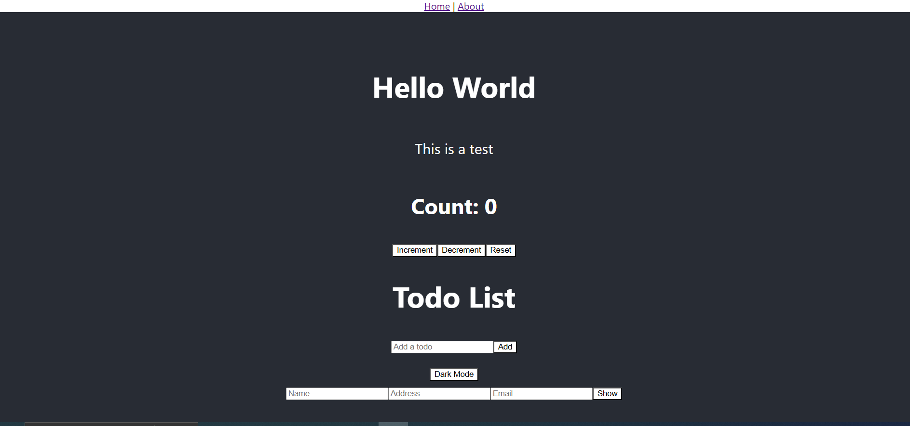

# React.js Overview

## What is React.js?
React.js is a JavaScript library for building user interfaces. It allows developers to create reusable UI components and manage application states efficiently. React uses a declarative paradigm that makes code more predictable and easier to debug.

## How React Works
React updates the UI efficiently by using a **Virtual DOM** (Document Object Model). Instead of directly modifying the real DOM, React creates a virtual representation of the DOM and updates only the changed parts, making rendering much faster.

### Virtual DOM vs Real DOM
- **Real DOM**: When changes occur, the entire DOM is updated, which can be slow.
- **Virtual DOM**: React creates a lightweight copy of the real DOM and updates only the changed elements, improving performance.

## React File Structure
A typical React project follows this structure:

```
my-react-app/
│-- node_modules/         # Installed dependencies
│-- public/               # Static files (index.html, favicon, etc.)
│-- src/                  # Source code
│   │-- components/       # Reusable components
│   │-- App.js            # Root component
│   │-- index.js          # Entry point
│   │-- styles.css        # Global styles
│-- package.json          # Project metadata and dependencies
│-- .gitignore            # Files to ignore in Git
│-- README.md             # Project documentation
```

### Key Files in a React Project
- **`index.js`**: Entry point that renders the React app.
- **`App.js`**: Main component where other components are used.
- **`components/`**: Folder to store reusable UI components.
- **`package.json`**: Manages project dependencies.

## React Router
React Router allows navigation between different pages in a React application without refreshing the page. The main elements are:
- `<BrowserRouter>`: Wraps the app to enable routing.
- `<Routes>`: Contains multiple `<Route>` elements.
- `<Route>`: Defines a path and the component to render.

### Example Usage
```jsx
import { BrowserRouter as Router, Routes, Route } from 'react-router-dom';
import Home from './Home';
import About from './About';

function App() {
  return (
    <Router>
      <Routes>
        <Route path="/home" element={<Home />} />
        <Route path="/about" element={<About />} />
      </Routes>
    </Router>
  );
}

export default App;
```

## Sample React Components

### `App.js`
```jsx
import { BrowserRouter as Router, Routes, Route } from 'react-router-dom';
import './App.css';
import Counter from './Counter';
import Home from './Home';
import About from './About';
import Todo from './Todo';
import Pinfo from './Pinfo';
import Toggletheme from './Toggletheme';

function App() {
  return (
    <Router>
      <div className="App">
        <nav>
          <a href="/home">Home</a> | <a href="/about">About</a>
        </nav>
        <Routes>
          <Route path="/home" element={<Home />} />
          <Route path="/about" element={<About />} />
        </Routes>
        <header className="App-header">
          <h1>Hello World</h1>
          <p>This is a test</p>
          <Counter />
          <Todo />
          <Toggletheme />
          <Pinfo />
        </header>
      </div>
    </Router>
  );
}

export default App;
```

### `Counter.js`
```jsx
import React, { useState } from 'react';

function Counter() {
  const [cnt, setCnt] = useState(0);
  return (
    <div>
      <h2>Count: {cnt}</h2>
      <button onClick={() => setCnt(cnt + 1)}>Increment</button>
      <button onClick={() => setCnt(cnt - 1)}>Decrement</button>
      <button onClick={() => setCnt(0)}>Reset</button>
    </div>
  );
}

export default Counter;
```

### `Todo.js`
```jsx
import React, { useState } from 'react';

function Todo() {
  const [todos, setTodos] = useState([]);
  const [input, setInput] = useState('');
  
  const addTodo = () => {
    if (input.trim() !== '') {
      setTodos([...todos, input]);
      setInput('');
    }
  };

  return (
    <div>
      <h1>Todo List</h1>
      <input
        type="text"
        value={input}
        onChange={(e) => setInput(e.target.value)}
        placeholder="Add a todo"
      />
      <button onClick={addTodo}>Add</button>
      <ul>
        {todos.map((todo, index) => (
          <li key={index}>{todo}</li>
        ))}
      </ul>
    </div>
  );
}

export default Todo;
```

### `Pinfo.js`
```jsx
import React, { useState } from 'react';

function Pinfo() {
  const [data, setData] = useState({ name: "", address: "", email: "" });
  const [show, setShow] = useState(false);

  return (
    <div>
      <input type="text" placeholder="Name" onChange={(e) => setData({ ...data, name: e.target.value })} />
      <input type="text" placeholder="Address" onChange={(e) => setData({ ...data, address: e.target.value })} />
      <input type="email" placeholder="Email" onChange={(e) => setData({ ...data, email: e.target.value })} />
      <button onClick={() => setShow(true)}>Show</button>
      {show && (
        <table border="1">
          <tr><th>Name</th><th>Address</th><th>Email</th></tr>
          <tr><td>{data.name}</td><td>{data.address}</td><td>{data.email}</td></tr>
        </table>
      )}
    </div>
  );
}

export default Pinfo;
```

## Output Image


## Summary
This document covered the basics of React.js, including how it works, the concept of Virtual DOM, file structure, and React Router. It also provided sample components for a counter, a to-do list, user information input, and a theme toggle feature. By understanding these fundamental concepts and practicing with the example code, you can build more complex React applications efficiently.
